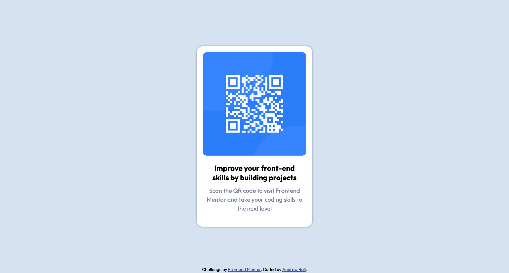

# Frontend Mentor - QR code component solution

This is my solution to the [QR code component challenge on Frontend Mentor](https://www.frontendmentor.io/challenges/qr-code-component-iux_sIO_H). Frontend Mentor challenges help you improve your coding skills by building realistic projects.

## Table of contents

- [Overview](#overview)
  - [Screenshot](#screenshot)
  - [Links](#links)
- [My process](#my-process)
  - [Built with](#built-with)
  - [What I learned](#what-i-learned)
  - [Continued development](#continued-development)
  - [Useful resources](#useful-resources)
- [Author](#author)
- [Acknowledgments](#acknowledgments)

## Overview

### Screenshot



### Links

- Solution URL: [Add solution URL here](https://your-solution-url.com)
- Live Site URL: <https://one-orb.github.io/frontend-mentor/qr-code-component/index.html>

## My process

I decided to try this challenge again from scratch. Among the reasons was discovering that in my last attempt to make sure I was using only semantic HTML I had used the `<figure>` tag completely wrong! I'm now a wee bit wiser and experienced, so let's see what I can improve on from my last attempt, I might even use GitHub and git properly this time.

### Built with

- Semantic HTML5 markup
- CSS custom properties
- Flexbox

### What I learned

Still getting to grips with how to use Git and GitHub, already made some mistakes with committing a `.DS_Store file` and improperly removing it. But already learning how to use them properly, just need to remember to add a `.gitignore` file before I start committing to the main branch and potentially use the following command to remove it from being tracked while leaving it behind on my local drive:

```git commands
$ git rm --cached <FILENAME>
```

I also set myself the challenge of trying to use semantic HTML as much as possible and further challenging myself to not use any `<div>` or `<span>` tags with classes or ids. I think that was where I fell off last time trying to use the `<figure>` tag to contain the card. This time I just used the \<main\> tag as that seemed the most appropriate of the choices, and it is the main (and only) element for the webpage. I even changed the .attribute class that the challenge came with and formatted it with the \<footer\> tag instead, as that was where I wanted it to be on the page. 

Building on it further, now that I had a "footer", I had to figure out how to get it down there. As I was using Flexbox to layout the card in the middle, I thought I could use `justify-self` to line it up at the bottom. I was thinking then I'd have the problem of the card not being laid out in the middle, little did I know, `justify-self` doesnt't exist in Flexbox. It took me having a look at other people's solutions and seeing [frontend-mentor's](hisprofilehere) solution to remember that the `position` attribute existed.Even better, if I set it to `absolute` then it would be taken out of the layout calculations so the card's position would still be in the middle based on Flexbox. What a win! I'm immortalising this winning code below:

```css
footer {
  position: absolute;
  bottom: 5px;
}
```

I also got a bit obsessed with CSS Resets on this project. I originally went with [Eric Meyer's Classic CSS Reset](insert link here) and it did the trick. However it was huge! And it got rid of some of the stylings that I wanted to keep, like the default `<h3>` styling, makes my life easier with the default styling rather than trying to adjust sizes myself. Through my googling I came across [Josh Comeay's Modern CSS Reset](instert kinke here) that was not only more compact but also did a lot of the things I was looking for. The bonus was Josh doing a great job of explaining each line of code. In this process, I've come to the conclusion that it's never one size fits all, it all depends on what you want to start with on a consistent basis. As a result, I decided not to use a cookie cutter approach but cherry picked the parts I like and the parts that are relevant to my current level. I'll keep adding to it as I need and save it within my personal files to keep as a reference. Here is what my current CSS Reset looks like:

```css
* {
  box-sizing: border-box;
  margin: 0;
}

etc
```

### Continued development

As these challenges/projects get more complicated I'm assuming that I'll need to get more accustomed to classes and ids rather than avoiding them like I have. A lot of the solutions looked overly complex, even from experienced coders, but looking at "normal" webpages I can see how that seems to be the norm for a lot of these websites. So something to keep in mind as these challenges grow in complexity and size, at some point I will need to use classes and ids not just semantic HTML. 

While I've gotten my head around CSS a bit better now, especially with Flexbox, I would still like to work on media queries. I was planning on using it here but as there wasn't a lot of content, there didn't seem to be a need to, Flexbox was enough to keep the content centered. Definitely something to look at and discovering that the inspect mode on Firefox had all the common screen sizes will make it easier to decide how and when to scale everything, I think.

### Useful resources

- [Josh Comeau](https://www.example.com) - A very helpful explanation on a modern CSS Reset with links to other resources. Will continue to add more to my personal reset from Josh's example.
- [MDN References](https://www.example.com) - Always the best cheat sheet to look up HTML tags and CSS properties.

## Author

- Website - [Andrew Ball](https://one-orb.github.io)
- Frontend Mentor - [@one-orb](https://www.frontendmentor.io/profile/one-orb)

## Acknowledgments

- [@such and such's](frontend orofile) [solution](link to his somution here) was super helpful as it reminded me of the position attribute and how to use it properly. 
